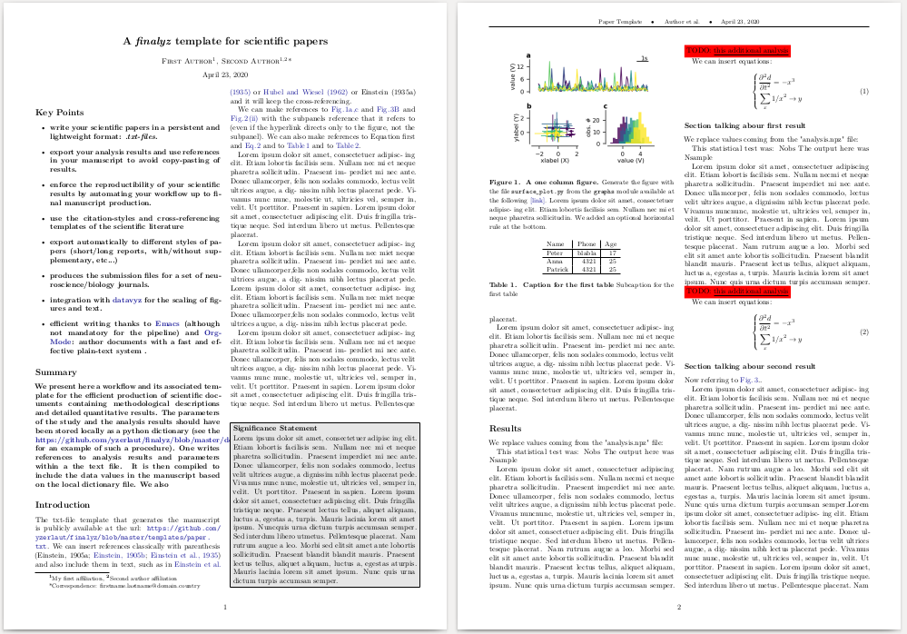
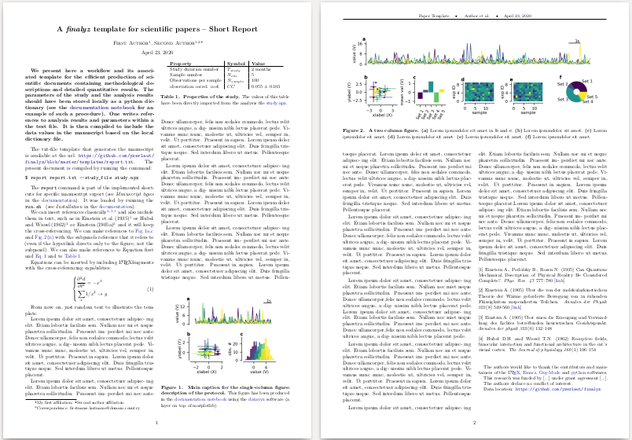
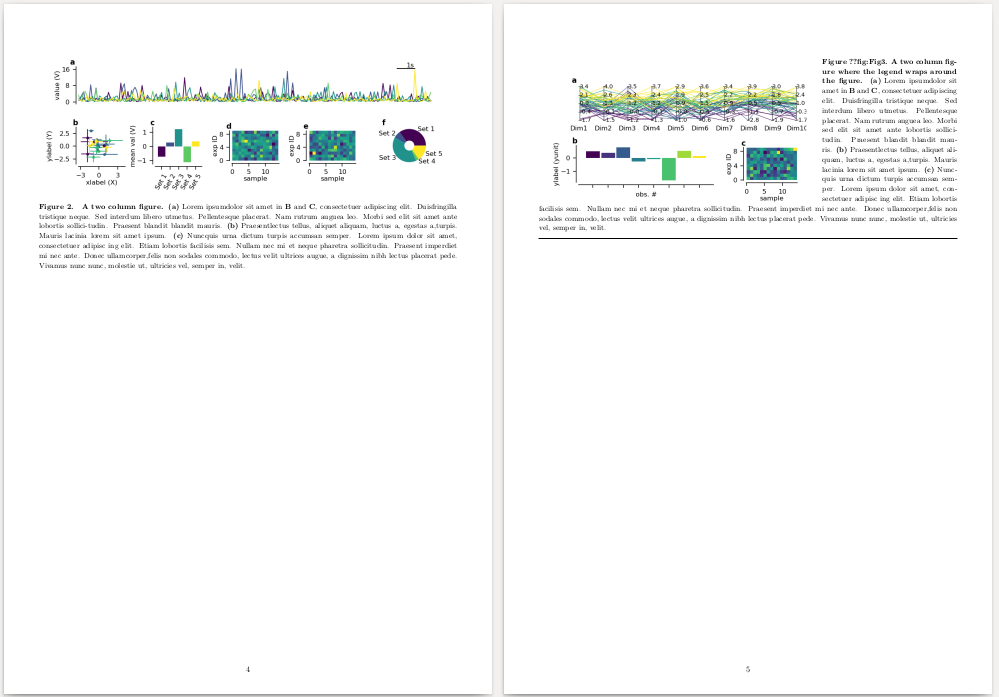
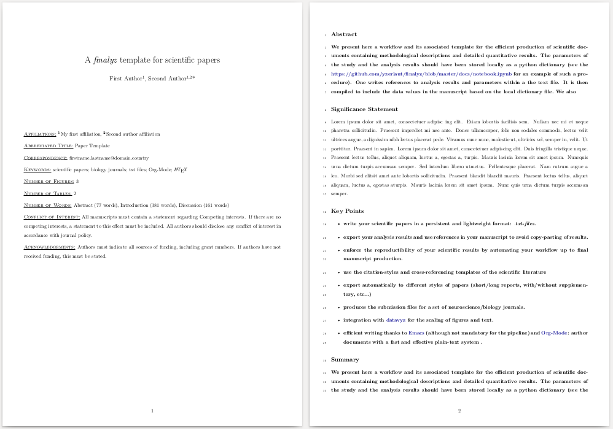
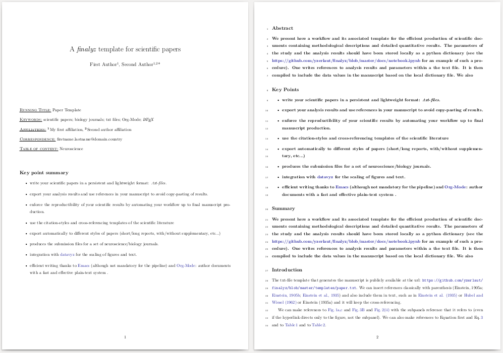

<div></div>

# finalyz

*A plain text (.txt)-based framework to efficiently describe methods and results in scientific communications.*

Part of the software suite for data science:
[analyz](https://github.com/yzerlaut/analyz), [datavyz](https://github.com/yzerlaut/datavyz), [finalyz](https://github.com/yzerlaut/finalyz)

## Idea / Principle

What this software enables is to:
- Perform automated export of quantitative results into manuscripts (no copy-paste of analysis results!)
- Benefit from the LaTeX support of figure, equations and corss-referencing in a simple markdown-like language: [Org-Mode](https://orgmode.org).
- provide bibliographic management and use different citation styles
- export to diverse formats/templates from the same manuscript file (see all [Manuscript Templates](https://github.com/yzerlaut/finalyz#manuscript-templates))
- benefit from the [Emacs](https://www.gnu.org/software/emacs/) editing capabilities when drafting your manuscript.

## Installation

- Need a LaTeX distribution, e.g. [MiKTeX](https://miktex.org/download) on MsWin, TeXlive on Linux (`apt-get install texlive-base`). Some additional LaTeX packages will be need (e.g. `float`, `wrapgfig`, `multirow`, ...)

- `finalyz` source code

Clone the repository and install the module
```
git clone https://github.com/yzerlaut/finalyz
cd finalyz/
pip install . 
```

## Use 

1. perform your quantitative analysis as store your results as `your_study_file.npz` (see the [documentation notebook](./docs/notebook.ipynb) for an example of such analysis file)
2. draft your paper/presentation/report on a "txt" file (see the templates in the [template folder](https://github.com/yzerlaut/finalyz/tree/master/templates)
3. compile it with:

```
python -m finalyz you_paper.txt --study_file your_study_file.npz
```
(see the below section  [Manuscript Templates](https://github.com/yzerlaut/finalyz#manuscript-templates) for a few shortcuts to specific journal formats, preprint templates, ...)

## Manuscript templates

The different manuscript templates covered are:

### article

This is the default `finalyz` command:
<p align="center">

</p>
  
### report

This is a format for short communications.

Use the `report` command directly. This is a shortcut for:
```
finalyz your_paper.txt --report --abstract_key '' --citation_style 'number_exponents' --references_key '' --insert_informations_at_the_end
```
<p align="center">

</p>
  
### figures only

Export a pdf-file with only your figures

Use:
```
finalyz your_paper.txt --figures_only # or just '-fo' as a shortcut
```
<p align="center">

</p>

Generating submission files given specific journal guidelines:

### [Journal of Neuroscience](https://jneurosci.org)

Use:
```
finalyz your_paper.txt --journal JNeurosci
```
  
Note the automated manuscript analysis ! (word count per section, ...)
<p align="center">

</p>
  
### [Journal of Physiology](https://physoc.onlinelibrary.wiley.com/journal/14697793)

Use:
```
finalyz your_paper.txt --journal JPhysiol
```
<p align="center">

</p>

### soon to come [...] 

other pre-defined templates: PloS journals, Springer journals, Physical Review journals, Cell journals,  [...]

	
## Include quantitative results 

We show here how to use cross-referencing extracted from an analysis file to report the results of the study. In this demo case (generated in the [documentation notebook](https://github.com/yzerlaut/finalyz/blob/master/docs/notebook.ipynb), the [study.npz](https://github.com/yzerlaut/finalyz/raw/master/docs/study.npz) file contains both study parameters and analysis results:

```
{'Nobs': 5,
 'Nsample': 100,
 'cc_coef_over_obs_max': 0.223,
 'cc_coef_over_obs_mean': 0.055,
 'cc_coef_over_obs_min': -0.122,
 'cc_coef_over_obs_std': 0.103,
 'cc_pval_over_obs_max': 0.856,
 'cc_pval_over_obs_min': 0.026,
 'mean_value': 1.605,
 'sem_value': 0.13,
 'study_duration': '2 months'}
```

we use the syntax (using python's dictionary replacement syntax):

```
The study was conducted over {study_duration}.
It contained {Nsample} of {Nobs} observations.
Signal was: {mean_value} $\pm$ {sem_value}.
Cross-correlation over observations was {cc_coef_over_obs_mean} $\pm$ {cc_coef_over_obs_mean} with minimum {cc_coef_over_obs_min} and maximum {cc_pval_over_obs_max}.
P-values of linear correlation spanned a range between pval={cc_pval_over_obs_min} and pval={cc_pval_over_obs_max}
```

are exported to:

> The study was conducted over 2 months. It contained 100 of 5 observations. Signal was: 1.605 ± 0.13. Cross- correlation over observations was 0.055 ± 0.055 with minimum -0.122 and maximum 0.856. P-values of linear correlation spanned a range between pval=0.026 and pval=0.856.

## Include references and choose citation style

References are included in the manuscript text with a plain text citation style:

```
A landwark study on visual cortex (Hubel and Wiesel, 1962), ...
```

The compiled citation will depend on the citation style used.
- For `finalyz your_paper.txt --citation_style text # default settings`, one gets:
> A landwark study on visual cortex (Hubel and Wiesel, 1962)

- For `finalyz your_paper.txt --citation_style number`, one gets:
> A landwark study on visual cortex [1]

- For `finalyz your_paper.txt --citation_style exponent_number`
> A landwark study on visual cortex<sup>1</sup>


All cited references should point to a bibtex entry in the `References` section, e.g.:
```
* References

@article{Hubel_and_Wiesel_1962,
  title={Receptive fields, binocular interaction and functional architecture in the cat's visual cortex},
  author={Hubel, David H and Wiesel, Torsten N},
  journal={The Journal of physiology},
  volume={160},
  number={1},
  pages={106--154},
  year={1962},
  publisher={Wiley Online Library}
}
```

## Include equations
	
Equations can be created using the LaTeX syntax:
```
\begin{equation}
\label{eq:eq1}
\left\{
\begin{split}
& \frac{\partial^2 d}{\partial t ^2} = -x^3 \\
& \sum_{x} 1/x^2 \rightarrow y
\end{split}
\right.
\end{equation}
```

references to equations are passed using the label of the equation as:
```
The model corresponding to Equation {eq:eq1} captures ...
```
By default it will export to:
> The model corresponding to Eq. 1 captures ...

but you can set the `equation_key` explicitely, for example compiling:
```
finalyz your_paper.txt --equation_key 'Equation'
```
will produce:
> The model corresponding to Equation 1 captures ...

## Include figures

Make a dedicated `Figures` section in the manuscript and fill it with your caption (main caption in bold) and subcaption in normal text, e.g.:
```
* Figures

*** Main caption for the single-column figure: description of the protocol.
#+options : {'label':'Fig1', 'extent':'singlecolumn', 'file':'docs/fig1.png', 'page_position':'b!'}
This figure has been produced in the documentation notebook using the datavyz software (a layer on top of matplotlib).
```

Figures can then be placed in the text with:
```
[[Figure {protocol-description} around here]]
```
and referenced by the plain text:

```
The protocol is described in Figure {protocol-description}, ...
```
By default it will export to:
> The protocol is described in Fig. 1, ...

but you can set the `figure_key` explicitely, for example compiling:
```
finalyz your_paper.txt --figure_key Figure'
```
will produce:
> Figure 1 describes the protocol, ...

## Manuscript informations

The set of manuscript informations are:

- Title
- Short title
- Authors
- Short authors
- Affiliations
- Correspondance
- Keywords
- Conflict of interest
- Acknowledgements
- Funding

They can be set up either in the preamble, e.g. as:

```
#+Title: A template for scientific papers
#+Authors: First Author{1}, Second Author{1,2}*
#+Short title: Paper Template
#+Short authors: Author et al.
#+Affiliations: {1} My first affiliation, {2} Second author affiliation
#+Conflict of interest: The authors declare no conflict of interest
```

or in the information section as:

```
* Informations
*** Title
A template for scientific papers

*** Authors
First Author{1}, Second Author{1,2}*

*** Short title
Paper Template

*** Short authors
Author et al.

*** Affiliations
{1} My first affiliation, {2} Second author affiliation

*** Conflict of interest
The authors declare no conflict of interest
```

